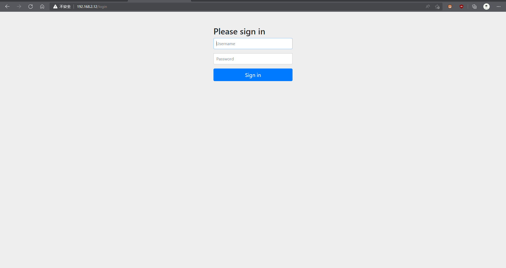

# spring cloud security搭建过程

##### 1、引入依赖

```MAVEN
<!-- 引入lombok依赖 使用注解，提高开发效率，使代码更加简洁 -->
<dependency>
    <groupId>org.projectlombok</groupId>
    <artifactId>lombok</artifactId>
</dependency>
<!-- srping boot web依赖，mvc框架必备 -->
<dependency>
    <groupId>org.springframework.boot</groupId>
    <artifactId>spring-boot-starter-web</artifactId>
</dependency>
<!-- 登录权限验证依赖 -->
<dependency>
    <groupId>org.springframework.boot</groupId>
    <artifactId>spring-boot-starter-security</artifactId>
</dependency>
```

##### 2、实现UserDetailsService类 ，重写该方法

```java
@Service
public class UserDetailsServiceImpl implements UserDetailsService {

    @Override
    public UserDetails loadUserByUsername(String username) throws UsernameNotFoundException {
        //查询用户信息
        LambdaQueryWrapper<SysUser> queryWrapper = new LambdaQueryWrapper();
        queryWrapper.eq(SysUser::getLoginName, username);
        SysUser user = new SysUser().selectOne(queryWrapper);
        if (Objects.isNull(user)) {
            throw new RuntimeException(CodeEnum.USER_OR_PASSWORD_ERROR.getMsg());
        }
        //TUDO 查询对应的权限信息
        Collection<GrantedAuthority> authorities = new ArrayList<>();
        //把数据封装成 UserDetails 返回
        //return new User(user.getName(), user.getPassword(), authorities);
        return new SysUserDetails(user);
    }
    
    
    
@Builder
@Setter
@Getter
public class SysUserDetails implements UserDetails {
    private SysUser user;

    @Override
    public Collection<? extends GrantedAuthority> getAuthorities() {
        return null;
    }

    @Override
    public String getPassword() {
        return user.getPassword();
    }

    @Override
    public String getUsername() {
        return user.getLoginName();
    }

    @Override
    public boolean isAccountNonExpired() {
        return true;
    }

    @Override
    public boolean isAccountNonLocked() {
        return true;
    }

    @Override
    public boolean isCredentialsNonExpired() {
        return true;
    }

    @Override
    public boolean isEnabled() {
        return true;
    }
}
```

启动项目，输入账号密码，发现后台报错There is no PasswordEncoder mapped for the id "null"，原因是Security密码加密问题，需要设置密码加密类型



```java
@Configuration
public class SecurityConfig extends WebSecurityConfigurerAdapter {
    @Bean
    public PasswordEncoder passwordEncoder() {
        return new BCryptPasswordEncoder();
    }
}
```

注入以后重新启动


------

[返回上页](index.md)

