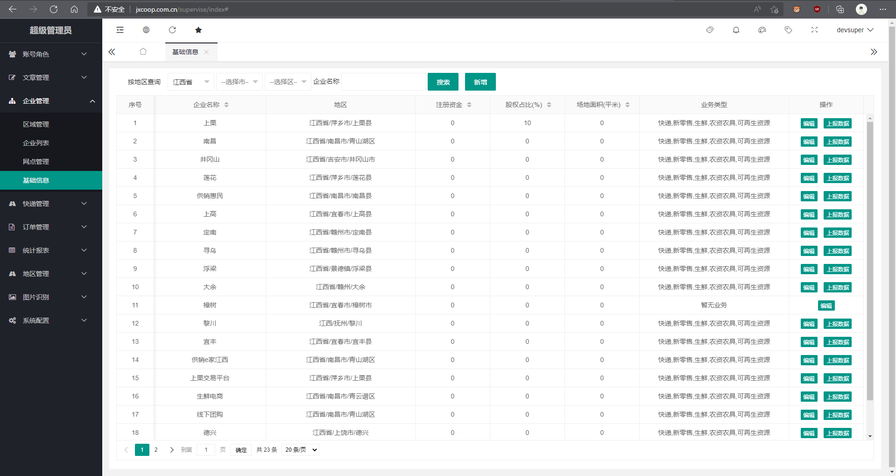
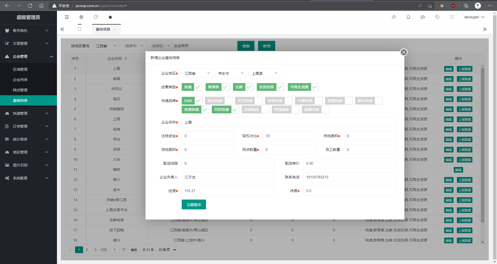
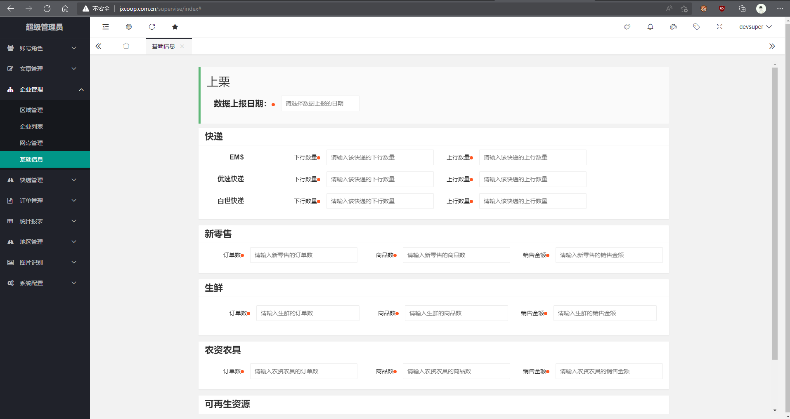
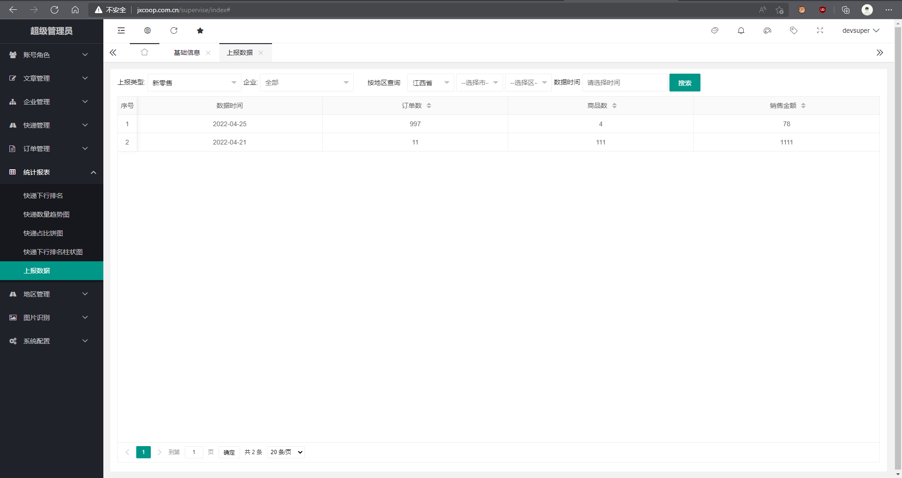

# 城乡流通直报系统


## 编写目的


## 项目概述

​	本系统用来采集江西省内开展的“互联网+第四方物流”项目数据，通过人员主动上报数据，省平台进行云图展示。

## 数据采集

### 基本数据

###### 企业信息

- 企业名称
- 注册资金
- 供销社股权占比
- 员工数量：快递员工、新零售员工、生鲜员工或者按配送员、分拣员、采购员再细分
- 设备信息：车辆、分拣设备、分拣线、智能货柜
- 场地面积：快递分拣面积、新零售仓库面积、生鲜分拣面积、可再生资源分拣面积
- 仓库来源
- 仓库单价
- 网点数量、坐标点、类型
- 快递品牌：四通一达、天猫、京东、苏宁、拼多多、唯品会等
- 快递配送单价
- 新零售品牌：哇哈哈、蒙牛
- 生鲜品类：肉类、蔬菜、海鲜、干货
- 可再生资源品类
- 农资农具品类
- 配送线路
- 合作伙伴

### 经营数据

以下数据以表格形式展示

###### 快递

| 日期 | 快递名称 | 上行数量 | 下行数量 |
| ---- | -------- | -------- | -------- |
|      |          |          |          |

###### 新零售

| 日期 | 品牌 | 商品 | 数量 | 订单数 | 金额 | 销售渠道 |
| ---- | ---- | ---- | ---- | ------ | ---- | -------- |
|      |      |      |      |        |      |          |

###### 生鲜配送

| 日期 | 商品名 | 数量 | 订单数 | 金额 | 销售渠道 |
| ---- | ------ | ---- | ------ | ---- | -------- |
|      |        |      |        |      |          |

###### 农资农具

| 日期 | 商品名 | 数量 | 订单数 | 金额 | 销售渠道 |
| ---- | ------ | ---- | ------ | ---- | -------- |
|      |        |      |        |      |          |

###### 可再生资源

| 日期 | 商品名 | 数量 | 订单数 | 金额 | 销售渠道 |
| ---- | ------ | ---- | ------ | ---- | -------- |
|      |        |      |        |      |          |

## 主要功能

### 后台管理

#### 企业管理

##### 基础信息

该功能用来录入管理企业的基础数据，包括企业名称，注册资金，股权占比，经营类型及坐标地点





上报数据




上报数据查看




### 	大数据云图

各县基础数据和快递、新零售、生鲜、农资农具等经营性数据展示

### 	接口端

用户登录、用户权限、各县数据请求

## 开发方案

~~系统采用spring cloud架构，总共分为后台上报、大数据云图、数据接口三个端口~~

在原有系统上优化填报数据功能，并增加导入导出功能，用来填报经营性数据

### 数据库设计

##### 基础数据表设计

```mysql
#企业基础数据表
CREATE TABLE `b_company_base`(
    `id` int(11) NOT NULL AUTO_INCREMENT,
    `code_id` int(6) NOT NULL DEFAULT '0' COMMENT '邮政编码',
    `name` varchar(50) DEFAULT '' COMMENT '公司名称',
    `registered_capital` int(11) DEFAULT 0 COMMENT '注册资金',
    `equity_ratio` int(3) DEFAULT 0 COMMENT '股权占比',
    `business_type` varchar(11) DEFAULT 0 COMMENT '经营类型:1快递,2新零售,3生鲜,4农资农具,5可再生资源',
    `staff_num` int(3) DEFAULT 0 COMMENT '员工数量',
    `shop_num` int(4) DEFAULT 0 COMMENT '店铺数量',
    `totle_area` int(5) DEFAULT 0 COMMENT '总场地面积',
    `express_brand` varchar(255) DEFAULT '' COMMENT '快递品牌',
    `express_price`  decimal(4,2) DEFAULT '0.00' COMMENT '配送单价',
    `route_num` int(2) DEFAULT 0 COMMENT '配送线路数量',
    `real_name` varchar(10) DEFAULT '' COMMENT '企业负责人',
    `phone` varchar(15) DEFAULT '' COMMENT '联系方式',
    `province` varchar(10) DEFAULT '' COMMENT '省份',
    `city` varchar(10) DEFAULT '' COMMENT '市',
    `area` varchar(10) DEFAULT '' COMMENT '区',
    `gps_x` float(10,7) DEFAULT 0 COMMENT 'gps x坐标',
    `gps_y` float(10,7) DEFAULT 0 COMMENT 'gps y坐标',
    `create_time` datetime DEFAULT NULL COMMENT '注册时间',
    `status` int(11) DEFAULT '1' COMMENT '状态 0：停用 1:正常 ',
    PRIMARY KEY (`id`)
) ENGINE=InnoDB DEFAULT CHARSET=utf8mb4 COMMENT='企业基础数据表';

#仓库基础信息表
CREATE TABLE `b_stoehouse_base` (
  `id` int(11) NOT NULL AUTO_INCREMENT,
  `code_id` int(6) NOT NULL DEFAULT '0' COMMENT '邮政编码',
  `company_id` int(11) DEFAULT 0 COMMENT '企业id',
  `name` varchar(10) DEFAULT '' COMMENT '仓库名称',
  `area` varchar(11) DEFAULT NULL COMMENT '仓库面积',
  `source_type` int(1) DEFAULT 0 COMMENT '仓库来源: 1自购,2租赁',
  `price` decimal(10,2) DEFAULT 0 COMMENT '租金:元/平米',
  `use_type` varchar(11) DEFAULT 0 COMMENT '使用类型:1快递,2新零售,3生鲜,4农资农具,5可再生资源',
  `gps_x` float(10,7) DEFAULT 0 COMMENT 'gps x坐标',
  `gps_y` float(10,7) DEFAULT 0 COMMENT 'gps y坐标',
  `create_time` datetime DEFAULT NULL ON UPDATE CURRENT_TIMESTAMP COMMENT '创建日期',
  PRIMARY KEY (`id`)
) ENGINE=InnoDB DEFAULT CHARSET=utf8mb4 COMMENT='仓库基础信息表';
```

##### 经营性表数据设计

```mysql
#删除表语句
drop table b_express_data_reporting;
drop table b_cmtc_data_reporting;
drop table b_ffd_data_reporting;
drop table b_am_data_reporting;
drop table b_rr_data_reporting;

CREATE TABLE `b_express_data_reporting` (
  `id` int(11) NOT NULL AUTO_INCREMENT,
  `code_id` int(6) NOT NULL DEFAULT '0' COMMENT '邮政编码',
  `company_id` int(11) DEFAULT 0 COMMENT '企业id',
  `express_name` varchar(17) DEFAULT '' COMMENT '快递名称',
  `up_num` int(11) DEFAULT '0' COMMENT '快递上行数量',
  `down_num` int(11) DEFAULT '0' COMMENT '快递下行数量',
  `data_time` date DEFAULT NULL COMMENT '快递数据时间',
  `create_time` datetime DEFAULT NULL COMMENT '创建时间',
  PRIMARY KEY (`id`)
) ENGINE=InnoDB DEFAULT CHARSET=utf8mb4 COMMENT='快递数据上报表';


CREATE TABLE `b_cmtc_data_reporting` (
  `id` int(11) NOT NULL AUTO_INCREMENT,
  `code_id` int(6) NOT NULL DEFAULT '0' COMMENT '邮政编码',
  `company_id` int(11) DEFAULT 0 COMMENT '企业id',
  `goods_name` varchar(50) DEFAULT '' COMMENT '商品名',
  `goods_num` int(11) DEFAULT '0' COMMENT '商品数量',
  `order_num` int(11) DEFAULT '0' COMMENT '订单数量',
  `totle_price` decimal(11,2) DEFAULT '0.00' COMMENT '订单总价',
  `data_time` date DEFAULT NULL COMMENT '数据时间',
  `create_time` datetime DEFAULT NULL COMMENT '创建时间',
  PRIMARY KEY (`id`)
) ENGINE=InnoDB DEFAULT CHARSET=utf8mb4 COMMENT='新零售上报数据表';


CREATE TABLE `b_ffd_data_reporting` (
  `id` int(11) NOT NULL AUTO_INCREMENT,
  `code_id` int(6) NOT NULL DEFAULT '0' COMMENT '邮政编码',
  `company_id` int(11) DEFAULT 0 COMMENT '企业id',
  `goods_name` varchar(50) DEFAULT '' COMMENT '商品名',
  `goods_num` int(11) DEFAULT '0' COMMENT '商品数量',
  `order_num` int(11) DEFAULT '0' COMMENT '订单数量',
  `totle_price` decimal(11,2) DEFAULT NULL COMMENT '订单总价',
  `data_time` date DEFAULT NULL COMMENT '数据时间',
  `create_time` datetime DEFAULT NULL COMMENT '创建时间',
  PRIMARY KEY (`id`)
) ENGINE=InnoDB DEFAULT CHARSET=utf8mb4 COMMENT='生鲜配送上报数据表';


CREATE TABLE `b_am_data_reporting`(
    `id` int(11) NOT NULL AUTO_INCREMENT,
    `code_id` int(6) NOT NULL DEFAULT '0' COMMENT '邮政编码',
    `company_id` int(11) DEFAULT 0 COMMENT '企业id',
    `goods_name` varchar(50) DEFAULT '' COMMENT '商品名',
    `goods_num` int(11) DEFAULT '0' COMMENT '商品数量',
    `order_num` int(11) DEFAULT '0' COMMENT '订单数量',
    `totle_price` decimal(11,2) DEFAULT NULL COMMENT '订单总价',
    `data_time` date DEFAULT NULL COMMENT '数据时间',
    `create_time` datetime DEFAULT NULL COMMENT '创建时间',
    PRIMARY KEY (`id`)
) ENGINE=InnoDB DEFAULT CHARSET=utf8mb4 COMMENT='农资农具上报数据表';

CREATE TABLE `b_rr_data_reporting`(
    `id` int(11) NOT NULL AUTO_INCREMENT,
    `code_id` int(6) NOT NULL DEFAULT '0' COMMENT '邮政编码',
    `company_id` int(11) DEFAULT 0 COMMENT '企业id',
    `goods_name` varchar(50) DEFAULT '' COMMENT '商品名',
    `goods_num` int(11) DEFAULT '0' COMMENT '商品数量',
    `order_num` int(11) DEFAULT '0' COMMENT '订单数量',
    `totle_price` decimal(11,2) DEFAULT NULL COMMENT '订单总价',
    `data_time` date DEFAULT NULL COMMENT '数据时间',
    `create_time` datetime DEFAULT NULL COMMENT '创建时间',
    PRIMARY KEY (`id`)
) ENGINE=InnoDB DEFAULT CHARSET=utf8mb4 COMMENT='可再生资源上报数据表';
```

---

[返回上页](../index.md)
