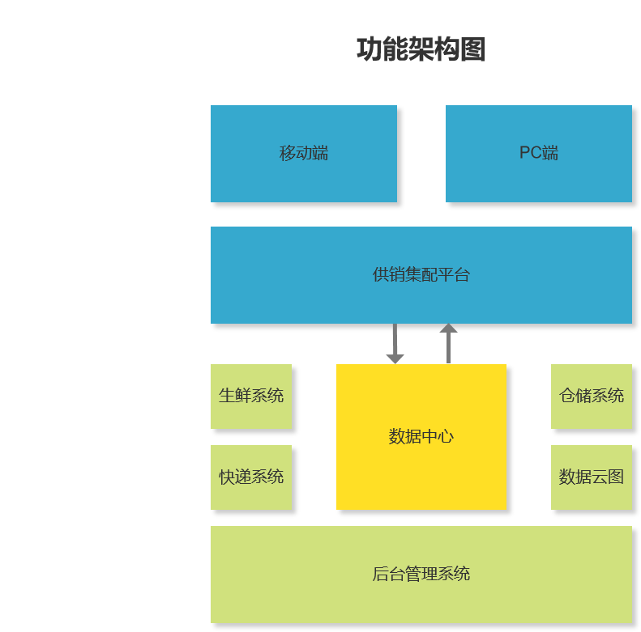

# 供销集配系统架构思路

## 1. 引言

###  1.1 概述

“互联网+第四方物流”供销集配体系建设，是县域商贸体系建设的重要内容，对服务农民生产生活、激活农村消费潜力、促进乡村振兴具有重要作用。为了更好满足农村生产生活和消费升级需求，完善城乡物流配送体系中的独特优势和重要作用，加快供销集配体系标准化规范化品牌化建设，补齐城乡物流基础设施短板，推进城乡物流资源和配送渠道共享共用，降低物流成本，提高流通效率，着力解决农产品进城“最先一公里”和工业品下乡“最后一公里”问题，运用现代信息技术手段，整合仓、货、车、线路、网点等资源，开展县乡村集中配送业务，培育打造江西供销集配服务品牌，构建起集约共享、开放惠民、安全高效、双向畅通的供销集配体系。

### 1.2 目的

为了规范系统开发，方便开发扩展，特此以文档形式将架构思路记录下来

## 2. 架构体系思路

### 2.1 功能架构

---

### 2.2 系统架构

---

### 2.3 技术架构

---

### 2.4 后台管理系统架构图

---

[返回上页](index.md)

